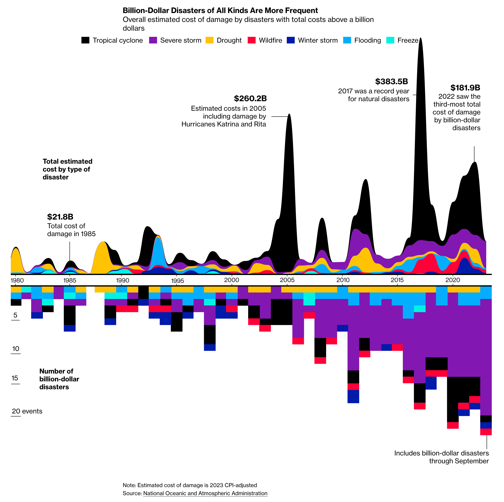
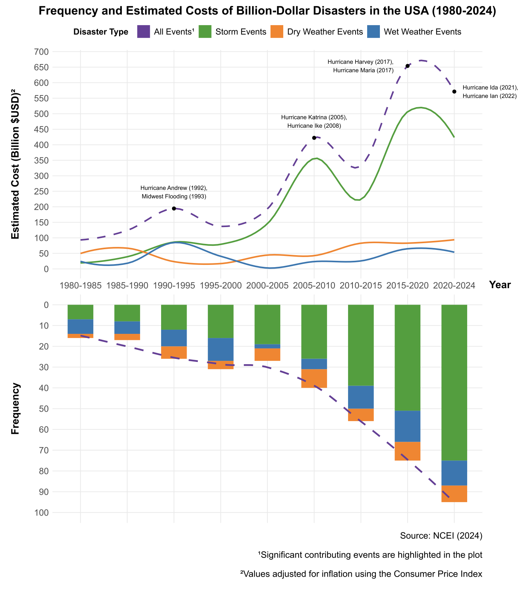

### Table of Contents
1. [Team](#team)
2. [Overview](#overview)
3. [Dataset and Methodology](#dataset-and-methodology)
4. [Repository Structure](#repository-structure)
5. [Program Usage](#program-usage)

### Team
---
<ins>P4 Team Oldlace</ins>
- Oh Jia Wei, Darien (*2200607*)
- Peter Febrianto Afandy (*2200959*)
- Quek Joo Wee (*2201046*)
- Desmond Loy Yong Kiat (*2201435*)
- Rene Low Yi Xuan (*2202620*)
- Phileo Teo Weihan (*2203179*)

### Overview
---
To highlight the need for enhanced disaster preparedness in the USA, Dottle and Kaufman [(2023)](https://www.bloomberg.com/graphics/2023-fema-disaster-relief-fund-extreme-weather-climate-aid/) presented a combined plot visualizing the total estimated costs by disaster type and the frequency of such events from 1980 to 2023. 



The plot demonstrated the increased frequency of various types of disasters over the years, likely driven by factors such as climate change, along with their escalating financial impact and costs.

This project is aimed at critiquing and improving the visualisation presented, using a grammar of graphics approach, whilst presenting reasonable justifications. 



Subsequently, the information and visualisations prepared are consolidated into a [poster](./poster/poster.pdf) format.

### Dataset and Methodology
---
To conduct analysis on Billion Dollar Disasters, two datasets published by the National Centers for Environmental Information (NCEI) of the United States of America were used [(NCEI, 2024)](#references). An additional dataset derived from the NCEI's [website](https://www.ncei.noaa.gov/access/billions/state-summary/US) via web scraping was also used to provide additional contextual information on individual BDD events.

To prepare the dataset for visualisation, a series of data processing steps were undertaken, including aggregating values across 5-year intervals, the creation of custom disaster categories, as well as data cleaning to remove unnecessary values. The data preparation conducted are documented in [`preparation.qmd`](./poster/preparation.qmd)

### Repository Structure
---
```
/poster (files for final poster)
    /_extensions (extensions used for rendering the poster)
    
    /data (contains dataset files)
    
    /images (images used for the poster)
    
    poster.pdf (main poster)
    
    poster.qmd (source file used to render the poster)
    
    preparation.qmd (source file used for data preparation)
    
    utils.R (supplementary code used during data preparations)

CSC3107-IV.Rproj (R Project file)

README.md (this file)
```

### Program Usage
---
To view the final poster, simply navigate to the [`poster.pdf`](./poster/poster.pdf) file and open it directly.

To render the poster directly from its source files, follow the steps below:
1. Open the `CSC3107-IV.Rproj` project file using RStudio (or any other R compatible IDE).
2. On R Studio, open the `poster.qmd` file and render it directly. To view the data preparation script, open the `preparation.qmd` file and render it directly.
3. Navigate to the [`poster.pdf`](./poster/poster.pdf) file and open it directly to view the rendered poster.